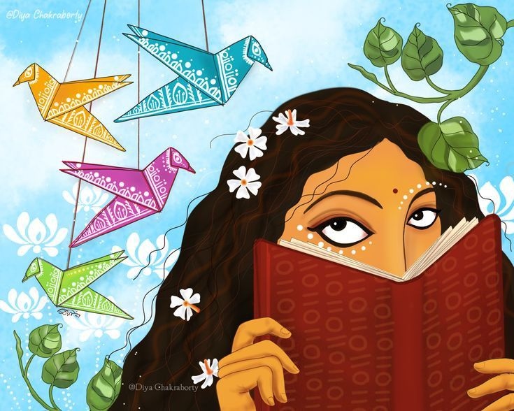

+++
date = '2025-09-09T13:15:39+05:30'
title = 'The Art Of More'
+++

 

Recently i have been told that there's a lot of "more" in and around me. When I say recently I mean a few years, the few years of my short life that I remember. I was ten when I first heard the word "more". I was asked to sing more boldly from my stomach and not from my throat. I tried. The next day I was asked to dance with more power so that the collision between my feet and the floor resonates amongst the audience who come to see my performance. I tried. The next day my teacher at school handed me my report card for the year and made a remark stating, " i expect more from you next time". So, I tried yet again next year but unfortunately I got the same remark. Year after year the phrases changed, the people who said it changed but the word "more" remained constant. At one point in my adolescence I grew fond of the word.

That might be a weird thing to say. To grow fond of a word, especially a word like more that is usually used in the context where I am demanded for something, well....more! But yes, the word grew on me. I found it complimentary when people used the word more and associated it with me. Almost always, someone or the other hand more expectations for me than I did for myself. I never understood that but I let it happen. I let it get through to me and i strived to be what people thought I was capable of doing, competent and able.  Things hit a curve when the word more became something similar yet completely different. The adult version of more walked into my life introducing itself as "too much". 

I was exposed to a new season in the series of my life where suddenly they didn't more from me but less of me. I was baffled initially and later reacted like how I would react to another ball thrown to my face, I laughed. I honestly found it amusing. These select few individuals spent years trying to groom me into this spectacular vision that they had in mind and then suddenly those same people along with a few new ones I picked up along the way decided to pick apart the "more" vision and bring in something new. I try not to sound selfish but, excuse me, where is my say in it all?

I sat there and watched the new set of " too much" vision unfold trying to pave way for the perfect ensemble of my personality. Things that were appreciated by "more" was scorned upon by "too much", especially my way of thinking and the precedence of feelings. I think too much a certain way that doesn't really let me be a better person that I am capable of being so I tried to feel better. But I feel too much that it invariably hinders my thinking leaving me in a loop to which there's no end. I was told I wanted to much out of life and that I felt too much. Is it too much?

I thought we only live once and that this life on earth at this point of time is ours, mine! I have access to so many things and what's wrong in wanting to see most if not all? Is that greedy? Is that needy? Is that right? Is that wrong? Is it unrealistic? Is it optimistic? Is it lack of control? Or is it simply unrealistic? I have absolutely no clue. A dear friend of mine always strived to seek the answer that we all yearn for invariably whether we know it or not, the absolute truth. He believes that the path to this destination is lonely and can make a person lose his or her mind in the process. Tempting. It is a noble attempt but do we demand more from him or is it too much to be asked to be left alone?
