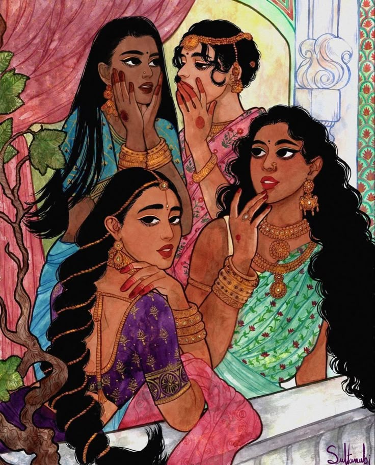

+++
date = '2025-08-20T20:38:08+05:30'
title = 'Choices'
+++

I apologise to start off on a negative note  but this is what bothered me enough to pick myself up and write. It wasn't the countless thoughts about existentialism that run through my head, not the patriarchal and misogynistic acts that I witness everyday and certainly not how I relate the mundane things in my life to myself and my muses. No. It was this version of myself that pushed me to question. What has been happening to me? For as long as I can remember, I have been taught to be so many things, an obedient daughter, a supportive friend, a quiet student and a good person. I did not know how to fill out these roles and still find time to figure out who i was without these roles attached to me. I found it baffling when people told me they understood me or that they "know" me when I was here standing in front of the mirror pushing my cheeks up , pulling my tummy in trying to see what version I can mould myself to be. 

I have never had a slightest clue as to who I am or was without attributing it to a role I was playing. But today, I look back on my recent timeline of events and feel confused.  I feel ashamed of the roles I played, not because I did not carry it out well but because i never questioned it. The same people who played a role in shaping my character proceeded to pick and prod making too many holes to mend. I sit with those holes questioning myself and those around me, asking where I went wrong for i do not know. I used the half baked answers they gave me to fill the holes and i proceeded to carry out the role hoping it would make things better. But when I looked at the mirror again, the thing that looked back at me did not resemble what I had perceived myself to be. I didn't think much about myself but I certainly knew i wasn't that thing that I saw. But how could I be so sure? I never really knew myself now did i?

As time went by, those answers that held me together fell apart. Eventually the mould withered away. I felt cold and naked sitting by myself with no mould to shackle me, or  protect me. I wondered who i was without something encapsulating me for the better or for worse. I felt an intense surge of fear passing through my body as I thought,  Am I always going to be known just by the role I played? It's difficult to be alone when you were never left alone to begin with. Solitude doesn't guarantee enlightenment, it might as well lead to madness. Once again I find myself at a crossroad wondering which way I must go. Just like that the fig tree appeared in front of me and I am afraid I'll be stuck under the cool shade of the beautiful tree filled with so many fruits not knowing which to eat. I can imagine myself under the tree, back against the bark, watching the leaves turn from green to yellow, snow turning to rain and my skeleton would be all that remains. The only thing I ever wished was to be witnessed , not seen, unapologetically, truthfully, nakedly. But it seems like that only the choices that I made or never did, would witness my miserable existence...
