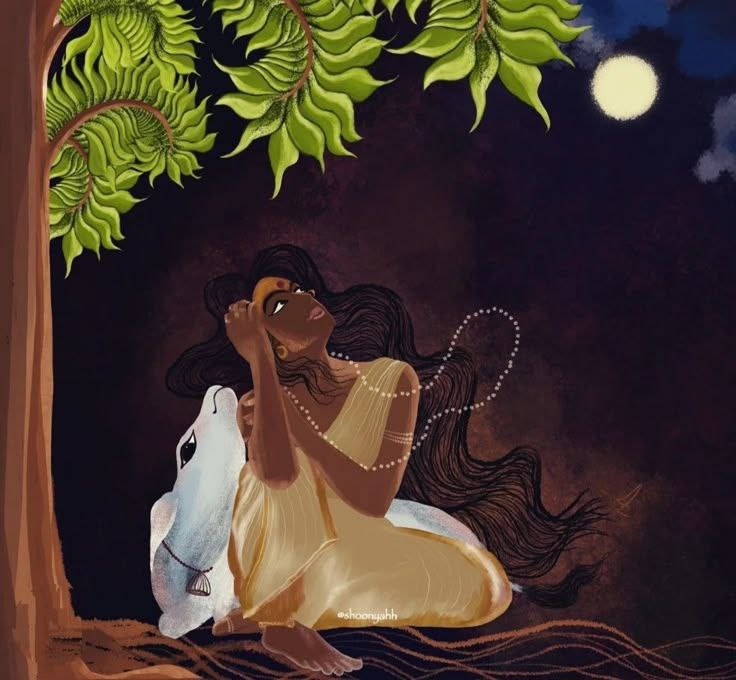

+++
title = "The Mystery of Letting Go"
date = "2025-12-25T19:51:00.000+00:00"
image = "cover-image-4.jpg"
+++

The mystery of letting go

The year has almost come to an end and I sit here thinking back on how different this twelve months have been in comparison to previous years I've spent time breathing in this mundane space on earth. I've always found something unique in noticing things that hide in plain sight. The victorious joy I feel when I unravel that mystery is unparalleled to any gay apparels I've felt so far. That's the joy and peace I feel now when I look back, a melancholic calm after a beautiful yet chaotic storm.

I did things that I have never done before like moving out of home, learning to cook, write more, capture things while living in the moment and many more. But the most precious takeaway from this year was finally figuring out the mystery of letting go with grace. Letting go of things or people has never been problematic for me because I always thought I had things figured out as to what was best for me. However, my three years journey in college was nothing less of a beautiful movie that taught me otherwise. I knew absolutely nothing and that was the best awakening i could ever ask for. The people and experiences that pushed me in this direction of thinking are no longer part of my life but the relationships that I cultivated during this time has stood through the tides. I've heard my mother say that not everyone will walk with you throughout your life and that's fine because you get to spend the little time you have with them in a more meaningful way. I laughed at her when she first told me that and said that all my friends will be by my side until we face death. Boy was I wrong. Ofcourse I do have a lot of cherished friendships that have lasted till date but there's a long path to death and there are bound to be some twists and turns. 

Anyways, I felt the meaning behind those words this year when I realised that some people are simply meant to be play a role in your life and you in theirs. I started of the year with strength, resilience and determination to be a better person than who I was before. I wanted to figure out if everything people told me about me, be it positive or negative, was true or not. And somehow, god or universe or whatever mysterious being aka my consciousness, decided to throw a win my way and help me figure things out. I realised how burdened I was about things around me, stories of my loved ones, my childhood, films that made me cry, being empathetic, and so much more. I was burdened with things that happened way back in the days and thought I had let it go. I did, to an extent. Even then, the smithereens from the blast left a little soot in my lungs making it hard to breathe, even in a place of clean air.

I began writing about it all and slowly unfurled the knots softly releasing each thread to its own resting space. I spoke with those who i could to move forward with the conflict and come at an agreement. But there were some with whom no reconciliation was possible. Over the years there had been fights, arguments and even violent outbursts followed with care, affection and loving promises yet no one could help but wish us apart. I didn't think much when I decided to embrace the quote from favourite song as a kid at the beginning of this year but that has been my driving mantra unconsciously. "Que sera sera, whatever will be will be". Simple words but I cannot explain the emotions I feel when I repeat it to myself right now.

Cutting people of from my life who serve no purpose but suck the energy out of me has been easy to do because the world was extremely black and white to see. But let go of the things or people you love is never easy since it's a constant battle between the mind and the heart. My friend and I never agreed with Robert Frost 's the road not taken analogy. The ultimatum it offered made no sense. Why can't we just go through both the roads at different times? I did it. I made a choice. And I let go of the things that made me who i am today in search of something better. I don't know if what I see will be in the same spectrum as what I've seen to compare, but I have learnt that there's nothing else to do except let myself be. I started of the year with so much gusto that I have decided to finish my year with a lot of rest and rejuvenation to embrace the next chapter of my life.
