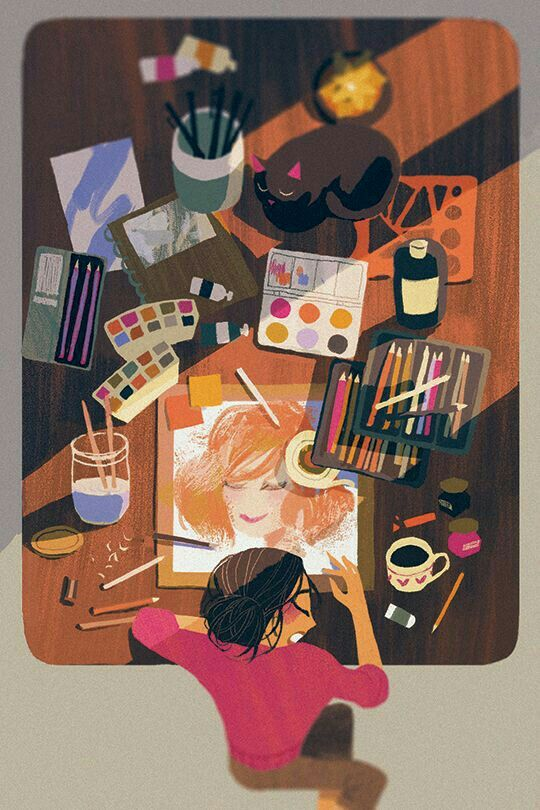

+++
date = '2025-09-01T20:24:21+05:30'
title = 'The Unoriginal Need to be Unique'
+++

 

I never considered myself to be an artist of any sort. Even if I wasn't a jack of all trades I was indeed a jack of multiple trades. I was never really a feminine person, rather i was quite a powerful dancer. I was not an elegant singer but a bold one. But my art on paper, be it words or lines that come out of my pencil was never really impactful for me. It always felt powerless and docile, like I had something to hide or scared to show. Dance and music was always intertwined within me. Anybody who looks at me would know how I start moving when I hear random beats or how I find music in the most random things around me. The weird synchronisation of the uncle on a cycle pedalling on the streets, or the crows deciding to be my orchestra for the day, I have always found things to be artistic without effort.

Appreciation for art came easily to me. I was always open to trying new music, different films, various genres and unique artists. Unique. It was during one such endeavour to find a new artist that I started questioning the meaning of being unique. This simple word travels around in so many masks like authentic, distinctive, special and much more all revolving around one's self. Be it their skills or their personality, everyone wanted to be stand out from the herd of laymen. I ,too, was one of the many who desperately tried to be someone special in an attempt to steer clear of the traditional route of life. I thought learning a certain discipline would set me apart but it brought me closer to like minded people. I was not ecstatic about this. I felt extremely disappointed that my thoughts and actions were no longer unique. My interest in art was parallely present but slumbering while I was under the pressure to be unique. Why was I under such a pressure? I still can't answer that with conviction but I have a few guesses.

I had completely given up learning the art of dance but continued to pursue music. I hadn't picked up a pencil to sketch in years but somehow found myself writing words that my trusted confidants labelled as poetry. I found it disturbing to think that I could exist with just music and not dance in my life. To me it has always been intertwined. I tried picking myself up to dance and failed. I tried again and failed. I tried again and failed again. I look around me and see artists everywhere. Especially in the digital era with content creation taking the front seat. It used to be overwhelming and now... it is absolutely redundant. Music has lost its magic, films are no longer depicting good cinema, and dance has become a little too commercialized for my liking. Everything felt forced and calculated. Art was flow to me. It was like water constant, curving, carving a path for itself and moving forward while adapting. 

Now, I think I've lost too much by forcing myself to be unique. I felt authentic when I sat against the ledge of my balcony, high off the ground, contemplating caste, politics and death with the moon hanging over me, guiding me. I wrote poems about things I had seen, or hope to see or feel. I felt original when I listened to artists cry melodiously over their broken hearts or how their mind felt alive when connecting with a person whom they can call theirs. Art felt original when there was no pressure to stand out or be unique. I don't know if I am a unique person but I'm going to try not be one, cause I tried being on the other side and it didn't really work out well.
