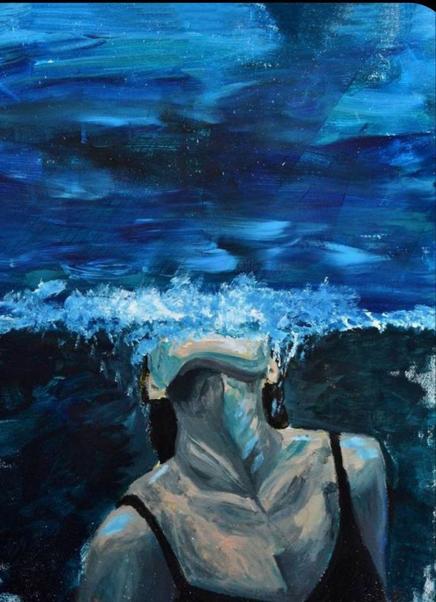

+++
title = "Afloat ?"
date = "2025-11-10T13:52:00.000+00:00"
image = "cover-image-2.jpg"
+++

Ever so beckoning like love
It lingers with every touch
Even when you stay away
It pulls you with so much trust
You know how it feels 
You know how it thinks
It makes you feel safe
Or so it seems
The longer you stay afloat
The more you tend to know
It gets more difficult to drown
Especially when you remember the calming sound
The waves crash inside your lungs
And you slowly cease to breathe
Oh the peace you feel
Is definitely hard to resist.
And just like the burden renews
Tempting you to dip your toes
What feels warm at first
Is simply freezing cold.
Maybe I will take the plunge
Maybe I'll learn to swim
But will I just lie there afloat
Something I'll never know.
