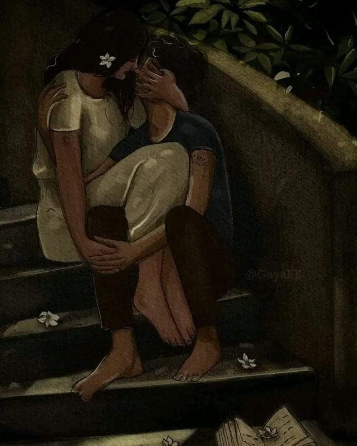

+++
title = "Coup de Grace"
date = "2025-11-22T11:11:00.000+00:00"
image = "cover-image-3.jpg"
+++

Silence fills our souls

While we Wait for each other at opposite poles,

No matter how hard we try

We seem to feel awry.

The push and pull eventually nipped 

The beautiful gordian knot, lay there ripped.

While we stood there still, life moved on

Us along with it but the yearning never stopped.

The shift in air was noticeable as we saw things anew

For we never knew that all that the cords needed was to be sewed.

And so we sat alone yet somehow together 

Beyond space,time and reality we began to hear.

Through the darkest twists and turns

Within the labyrinthine, you saw 

Even so the war between mind and heart never seems to die

Just like the eternal paradox that is, you and i

With every battle lost with unwavering consistency 

I stood there awaiting the final blow that is the Coup de Grace.
