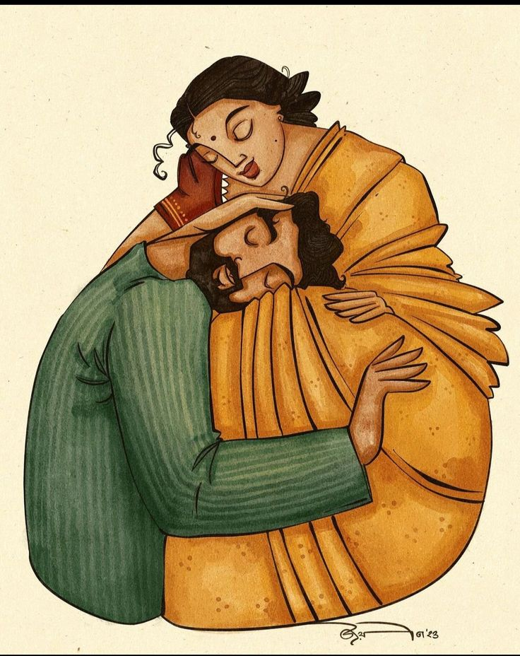

+++
date = '2024-09-11T08:36:41+05:30'
title = 'Holocene'
+++

I loved him once like I did no other, 
With so much passion that it made me wither. 
It was him whom I would coddle and smother  
In a world of our own away from all the  bother. 
What more could I ask for, with him defending my honour  
While I sat there relishing his care and candour. 

I lose myself everytime his eyes meet mine 
Lost in thought that aren't so divine 
And somehow figured out where to be 
 Cause always by his side was only me. 
And there I stayed until the final blow 
Only, it came so soon that we were left bereft of life so slow. 

I smile softly when I think of him and wipe away my tears when I remember 
He would love no other but me, only me 
For I was the warmth that thawed his frozen sea 
Imbuing a part of me in him and that's where I'll be 
And remain forever his Holocene.. 
