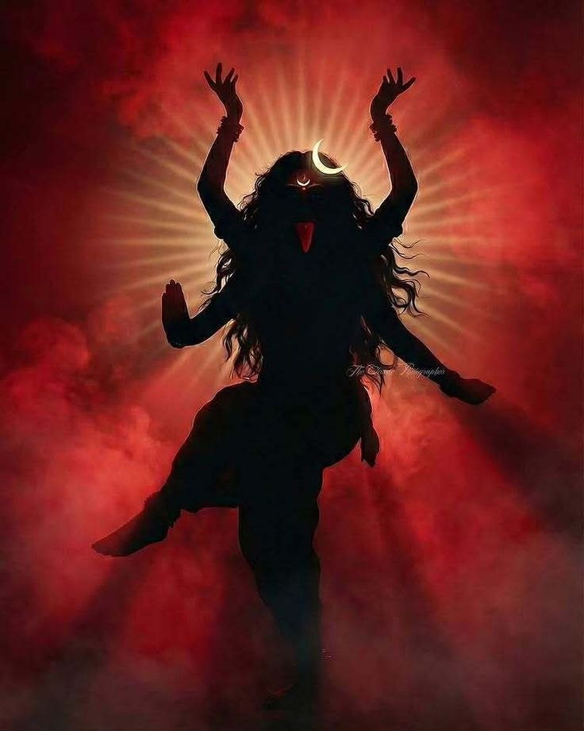

+++
title = "Kaali"
date = "2026-05-01T20:32:00.000+01:00"
image = "cover-image-6.jpg"
+++

Flowing ebony hair in the light 

That is only if she steps into it

Gentle locks of curls grazing

Her cheek and nose as it flows

Limbs move in synchronisation 

With every piece she hears

Wild and untamed to others

Yet free and full of anger for her

Her eyes redden matching her tongue

The fiery red stings her mouth

Pushing her to stick it out in agony

She jumps and slides from one tile to another

Unable to bare the release of fire

And just like that she burns in the dark

Incinerating those who dared to stand 

Beside her, with her, for her

Along with them burnt her tongue

The only one who stood through it all.
