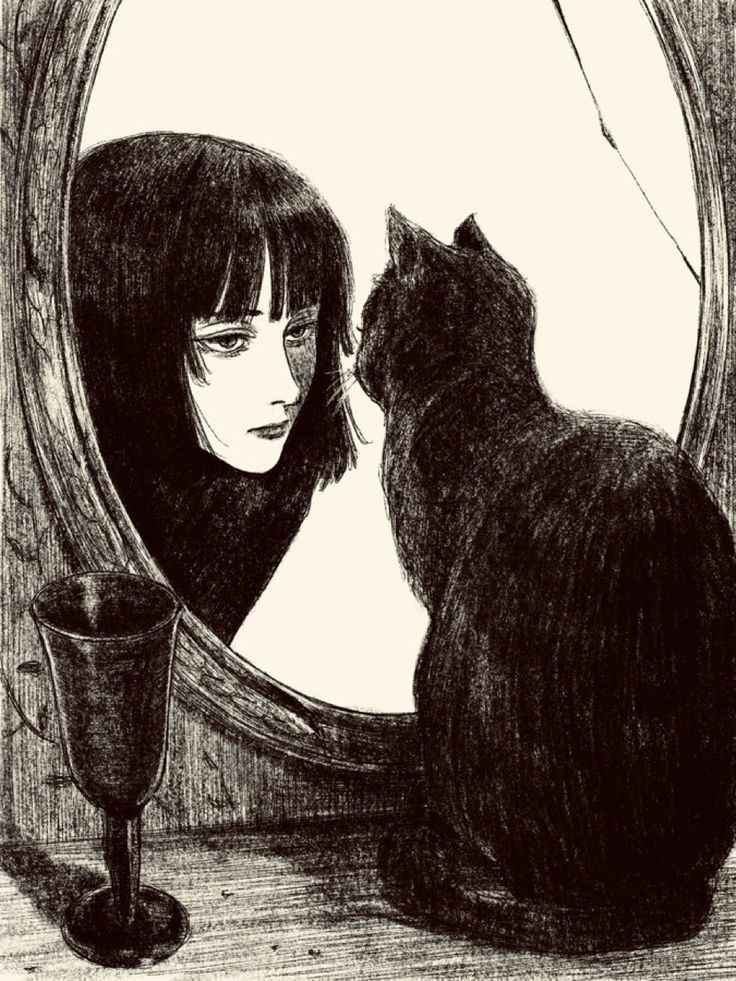

+++
date = '2025-01-27T08:37:03+05:30'
title = 'Sinned'
+++

Forgive me for I have sinned 
I get on my knees with my hands 
Intertwined holding each other 
The surity of this action leaves me appalled 
Cause I lack the clarity on what to pray for 
Hot tears rolled down my left cheek 
As I desperately tried to understand  
The constant question of what is it that I seek 
Kept running through my mind 
And then it dawned on me 
It was forgiveness that I sought 
For my mistakes and regrets 
I need to be repented I thought  
But what exactly do I ask redemption for? 
Is it for the way I am? Or the way I am not? 
Is it for who I've become? Or who I've not? 
Forgive me for I have sinned 
But what exactly have I done wrong? 
