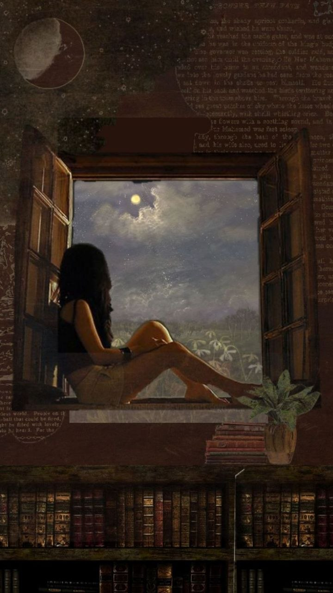

+++
title = "Sixteen"
date = "2026-05-01T20:28:00.000+01:00"
image = "cover-image-5.jpg"
+++

When I was sixteen once

I used to let my feet dangle

All the way from my haven

Always wondered how it would look

If it dangled as I stood.

I watched people walk

Right beneath my feet

God what ordinary lives they live

Let that never be me.

Slowly i inched closer

Making my feet move with the breeze

And continued contemplating 

What it is to simply be me.

I heard a bald guy yell at his wife

And a dog bark at its friend

I heard the cars honking for space 

And I sat there wondering how life plays.

I moved an inch closer

This time I felt a trebble

I looked up to see the sky light up

And gently groan and tremble.

My feet dangled wildly

As they grow wet and cold

My hands kept slipping

And all i could wonder was if I would grow old.

I try to push myself back

But I seem to make it worse

So in that never ending freefall

I was sixteen only once.
