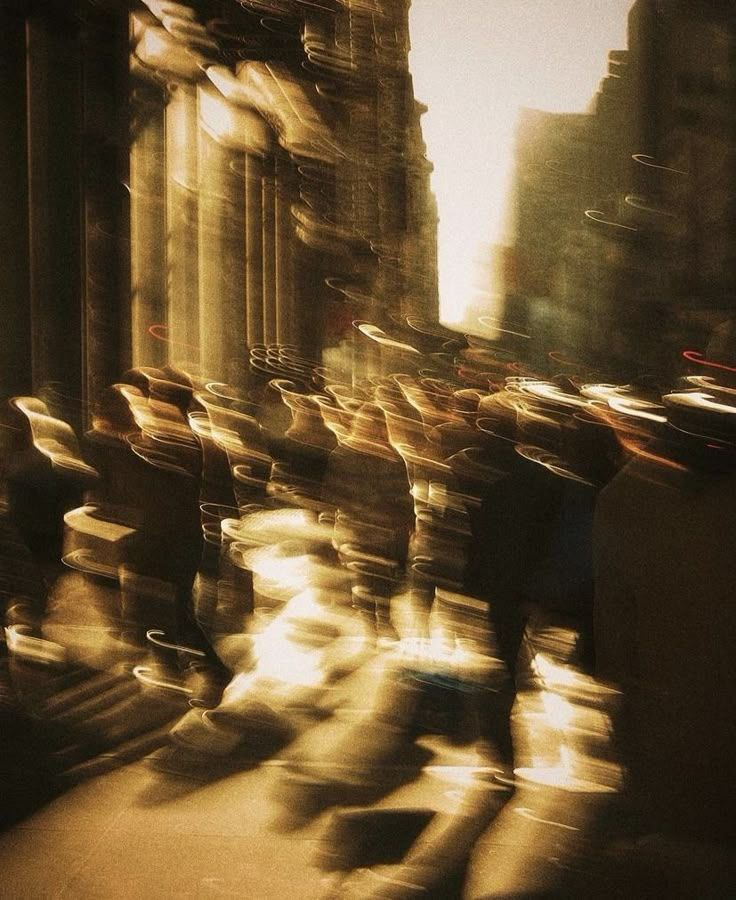

+++
title = "The Haze"
date = "2025-10-21T15:30:00.000+01:00"
image = "cover-images-1.jpg"
+++

The haze has a mind of its own

Always trying to cover what I had sown

Never let me see or hone

Always felt like I was being borne

Not once did it stop, the horn

The constant wailing was born

From the sound to my eyes I could've sworn

Low fidelity was all that shone.

The haze is a life of despair

Only one that you can never repair

With twisted thoughts to spare

And loved ones hearts to tear

The least i could do was stare

And watch as my haze declare

That I was and will only ever be bare.
